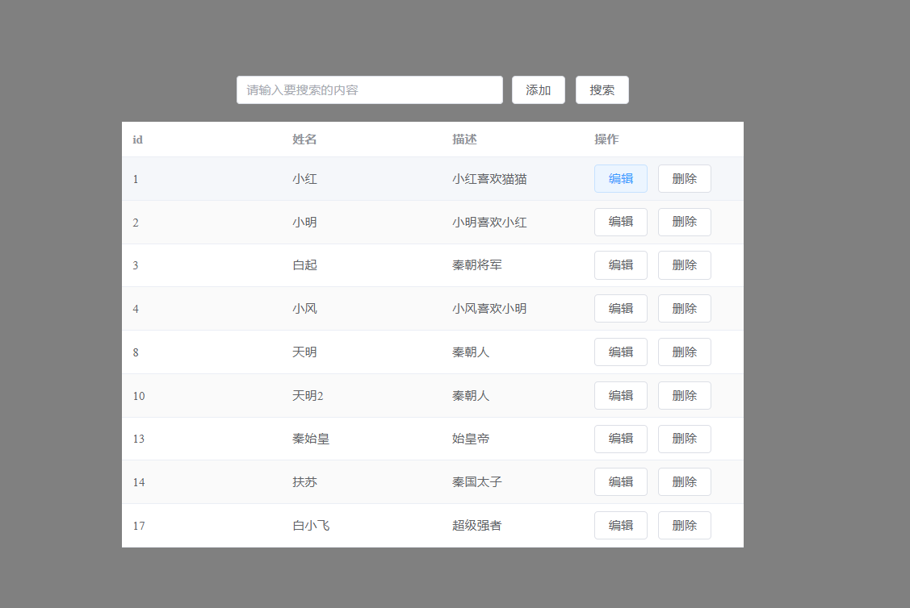
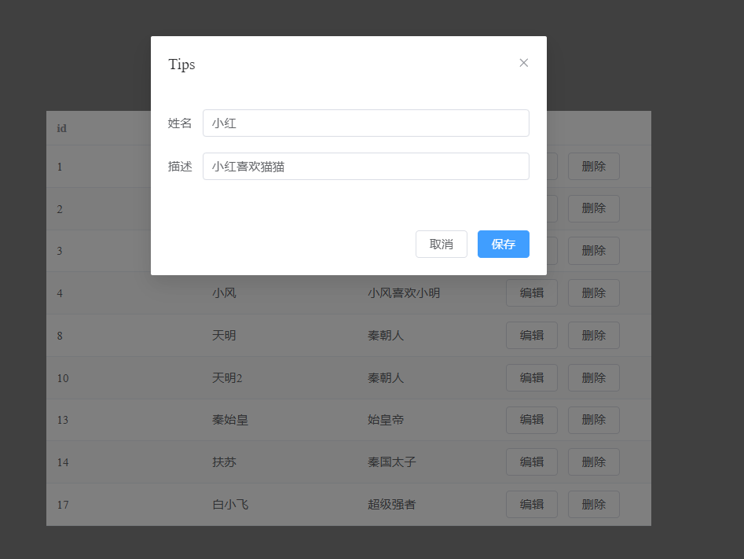
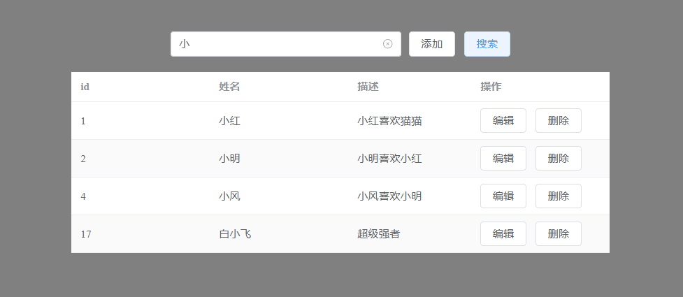

## Description

* 前端 front
* 后端 server

前端采用 Vue3 + Typescript + Axios + Element-plus

后端采用 NestJs + Prisma

一个简单的前后端分离的CRUD项目。

## 项目启动

提前新建一个名vue3crud的数据库，数据库我使用的是 Mysql

    cd server
    npm i 
    npm run start:dev

    cd front
    npm i 
    npm run dev

## 项目预览

以下是GPT生成

## 项目描述
这个项目是一个简单而健壮的前后端分离的CRUD应用程序。它允许用户通过直观互动的界面创建、阅读、更新和删除数据。

### 前端
前端使用 Vue.js 3 构建，利用 Composition API 更好地组织和复用逻辑。采用 TypeScript 增强了代码质量和可维护性，通过强类型和面向对象的特性。

为了发出 HTTP 请求，使用 Axios，因为它基于 Promise 的结构允许易于管理的异步代码。UI 组件采用 Element-plus 制作，它提供了一系列可定制和响应式的 Vue 组件，遵循现代设计原则。

### 后端
在后端，选择 NestJs 作为框架，因为它提供了开箱即用的应用程序架构和与 TypeScript 的亲和力。它通过提供易于维护的模块化结构，简化了可靠和可伸缩服务器端应用程序的构建。

Prisma 作为首选 ORM 集成，使得数据库访问和处理变得直接，通过其类型安全的数据库客户端。它简化了定义数据库模式和执行 CRUD 操作的过程。

### 整体架构
应用程序遵循模型-视图-控制器（MVC）架构模式来分离关注点，使代码库更易于管理和扩展。

 模型（Model）：使用 Prisma 定义，处理数据结构和数据库交互。
视图（View）：用 Vue 3 和 Element-plus 构造，为用户界面提供反应式和基于组件的结构。
控制器（Controller）：在 NestJs 中实现，包含连接模型和视图的业务逻辑。
通过分离前端和后端，项目确保每个部分可以独立开发、测试和扩展。这种关注点分离还有助于将来集成其他前端或后端技术。

### 通信
两部分通过 RESTful API 进行通信，提供客户端和服务器之间的无状态交互模型。使用 JSON 作为主要数据交换格式，促进易用和语言无关的协议。